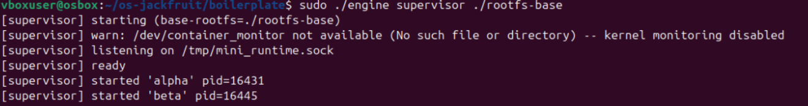
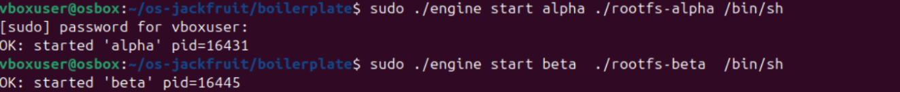
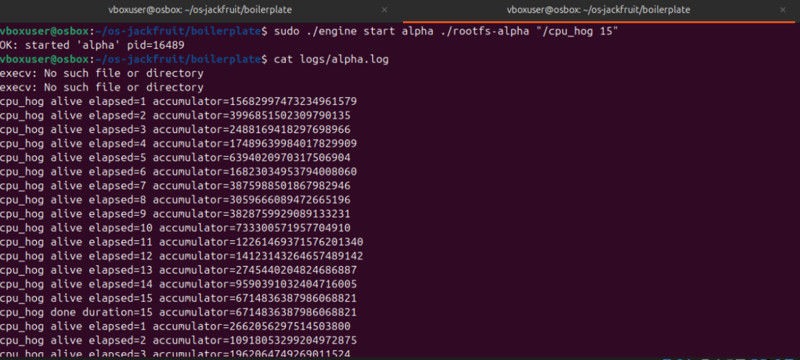
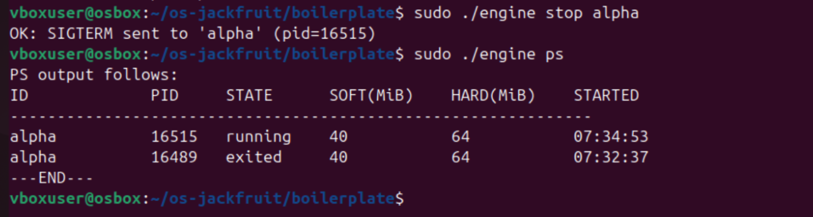
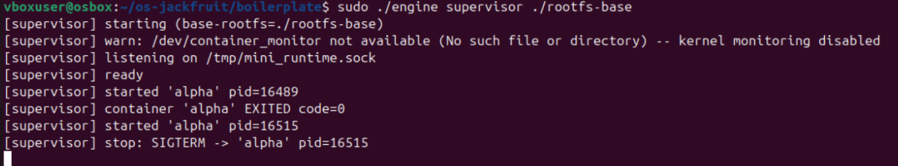
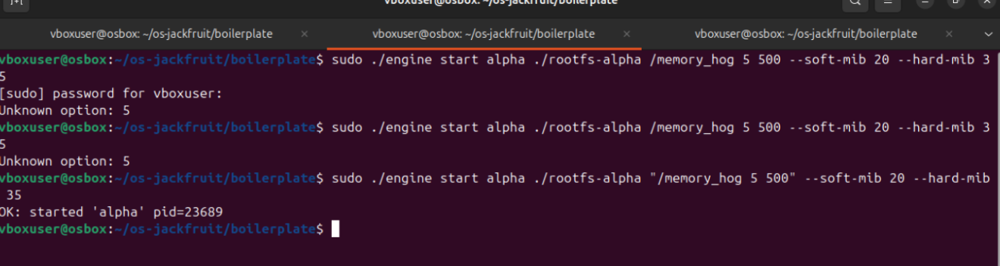
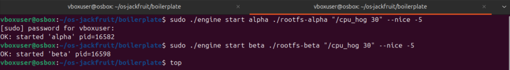
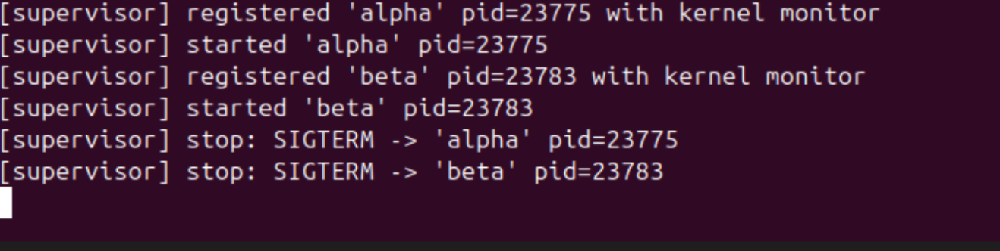
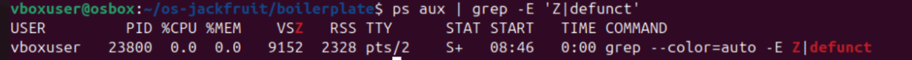

# Supervised Multi-Container Runtime

## Project Overview

This project implements a lightweight container runtime in C with a long-running supervisor process. The system supports running multiple containers, tracking their metadata, capturing logs, and performing scheduling experiments.

The implementation demonstrates core Operating Systems concepts such as:

* process isolation using namespaces
* inter-process communication (IPC)
* process lifecycle management
* synchronization using threads
* scheduling using nice values

---

## Environment

* Ubuntu 22.04 / 24.04 (Virtual Machine)
* Not supported on WSL
* Requires `sudo` for namespace operations

Install dependencies:

```bash
sudo apt update
sudo apt install -y build-essential linux-headers-$(uname -r)
```

---

## Build Instructions

```bash
cd boilerplate
make
```

This builds:

* `engine` (user-space runtime)
* `monitor.ko` (kernel module)

---

## Running the Project

### 1. Start Supervisor

Terminal 1:

```bash
sudo ./engine supervisor ./rootfs-base
```

---

### 2. Start Containers

Terminal 2:

```bash
sudo ./engine start alpha ./rootfs-alpha /bin/sh
sudo ./engine start beta  ./rootfs-beta  /bin/sh
```

---

### 3. View Container Metadata

```bash
sudo ./engine ps
```

This shows:

* container ID
* PID
* state
* memory limits
* start time

---

## Logging Demonstration (Task 3)

To generate logs, run a workload inside the container.

```bash
cp cpu_hog rootfs-alpha/
```

Restart supervisor (important to clear stale socket):

```bash
rm -f /tmp/mini_runtime.sock
sudo ./engine supervisor ./rootfs-base
```

Run workload:

```bash
sudo ./engine start alpha ./rootfs-alpha "/cpu_hog 15"
```

View logs:

```bash
cat logs/alpha.log
```

This demonstrates the bounded-buffer logging pipeline. 

---

## Stopping Containers

```bash
sudo ./engine stop alpha
```

---

## Kernel Monitor (Task 4)

Load kernel module:

```bash
sudo insmod monitor.ko
```

Verify:

```bash
ls -l /dev/container_monitor
```

---

### Memory Limit Test

```bash
cp memory_hog rootfs-alpha/
```

Terminal 1:

```bash
sudo ./engine supervisor ./rootfs-base
```

Terminal 3:

```bash
sudo dmesg -w
```

Terminal 2:

```bash
sudo ./engine start alpha ./rootfs-alpha "/memory_hog 5 500" --soft-mib 20 --hard-mib 35
```

Check metadata:

```bash
sudo ./engine ps
```

---

## Scheduling Experiment (Task 5)

Copy workloads:

```bash
cp cpu_hog rootfs-alpha/
cp cpu_hog rootfs-beta/
```

Start supervisor:

```bash
sudo ./engine supervisor ./rootfs-base
```

Run two containers with different priorities:

```bash
sudo ./engine start alpha ./rootfs-alpha "/cpu_hog 30" --nice -5
sudo ./engine start beta  ./rootfs-beta  "/cpu_hog 30" --nice 5
```

Monitor CPU usage:

```bash
top
```

Compare completion times:

```bash
tail -3 logs/alpha.log
tail -3 logs/beta.log
```

Expected:

* lower nice value → faster execution
* higher nice value → slower execution

---

## Cleanup Verification (Task 6)

Stop containers:

```bash
sudo ./engine stop alpha
sudo ./engine stop beta
```

Check for zombies:

```bash
ps aux | grep -E 'Z|defunct'
```

Check socket cleanup:

```bash
ls /tmp/mini_runtime.sock
```

Unload module:

```bash
sudo rmmod monitor
```

Check kernel logs:

```bash
dmesg | tail -3
```

---

## Key Concepts Demonstrated

* Supervisor-based container management
* Namespace isolation (PID, UTS, mount)
* UNIX domain socket IPC (CLI ↔ supervisor)
* Pipe-based logging (container → supervisor)
* Bounded buffer with producer-consumer threads
* Kernel-level memory monitoring (soft + hard limits)
* Linux scheduling using nice values

---

## Notes

* `/bin/sh` containers exit immediately (no logs)
* Workloads like `cpu_hog` are required to generate logs
* `rm -f /tmp/mini_runtime.sock` fixes stale socket issues
* `sudo` is required for most commands

---
## Demo Screenshots

### Task 1: Multi-container supervision

Shows two containers (`alpha` and `beta`) running simultaneously under a single supervisor process.



---

### Task 2: Metadata tracking (`ps`)

Displays container metadata including ID, PID, state, memory limits, and start time using the `engine ps` command.


---

### Task 3: Bounded-buffer logging

Shows output from `cpu_hog` captured in `logs/alpha.log`. Demonstrates the logging pipeline using producer-consumer threads.



---

### Task 4: CLI and IPC

Shows a CLI command (e.g., `engine start` or `engine logs`) communicating with the supervisor via the control IPC mechanism.



---

### Task 5: Soft-limit warning

Shows kernel log (`dmesg`) output when a container exceeds its soft memory limit. The process continues execution after the warning.


---

### Task 6: Hard-limit enforcement

Shows kernel log (`dmesg`) where a container is killed after exceeding the hard memory limit, along with updated state in `engine ps`.



---

### Task 7: Scheduling experiment

Shows two containers running CPU-bound workloads with different `nice` values, demonstrating difference in execution time or CPU share.



---

### Task 8: Clean teardown

Shows that all containers are stopped, no zombie processes exist (`ps aux`), and system resources are properly cleaned up.




---

## Conclusion

This project demonstrates how container runtimes operate using Linux primitives. It combines user-space and kernel-space components to manage processes, enforce resource limits, and analyze scheduling behavior in a controlled environment.